<p align="center">
  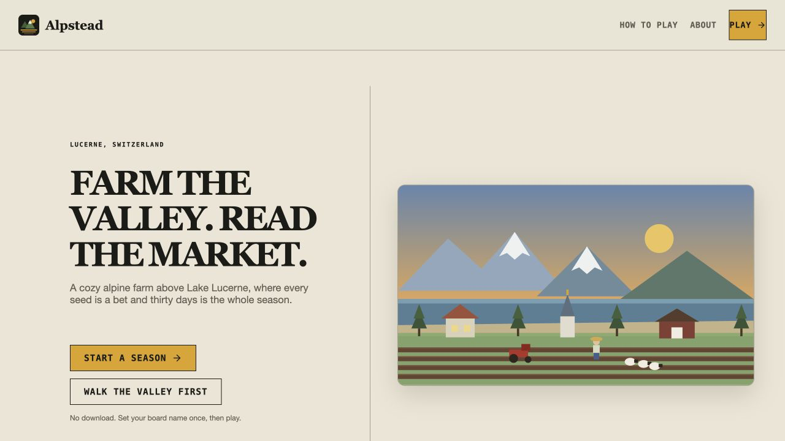
</p>

<h1 align="center">FieldTape — QuantPlayground</h1>

<p align="center"><strong>A playable farming system for learning capacity, capital, market impact, and decision-making under a hard deadline.</strong></p>

<p align="center"><em>Farm the valley. Read the market.</em></p>

<p align="center">
  <a href="https://fieldtape-quantplayground.vercel.app">Play live</a> ·
  <a href="https://fieldtape-quantplayground.vercel.app/fieldcraft">Fieldcraft</a> ·
  <a href="https://fieldtape-quantplayground.vercel.app/leaderboard">Leaderboard</a> ·
  <a href="#product-tour">Product tour</a> ·
  <a href="#license">AGPL-3.0</a>
</p>

<p align="center">
  <code>DETERMINISTIC SIMULATION</code> · <code>30-DAY SEASONS</code> · <code>SERVER-REPLAYED SCORES</code> · <code>FREE TO PLAY</code>
</p>

---

## The premise

FieldTape turns a 30-day alpine farm into a compact quantitative system. You do not just run out of money—you run out of **attention**. Every plot needs action, every worker changes the capacity ceiling, and every sale can move the shared market for the next decision.

It is a deterministic strategy and learning simulation. It is not agricultural, financial, or investment advice.
Built under 5hrs in OpenAI Codex Hackathon Solo.

| Farm decision | Quantitative idea |
| --- | --- |
| Add land or workers | Capacity planning and constrained optimisation |
| Buy seed or livestock | Capital allocation and opportunity cost |
| Delay a sale | Inventory risk, timing, and horizon management |
| Sell into the market | Supply impact and price response |
| Compare replayed runs | Reproducibility and verification |

## Product tour

Every image below is a fresh capture from the current [live FieldTape deployment](https://fieldtape-quantplayground.vercel.app).

| Play — 30-day decision surface | Village — 3D alpine exploration |
| --- | --- |
| 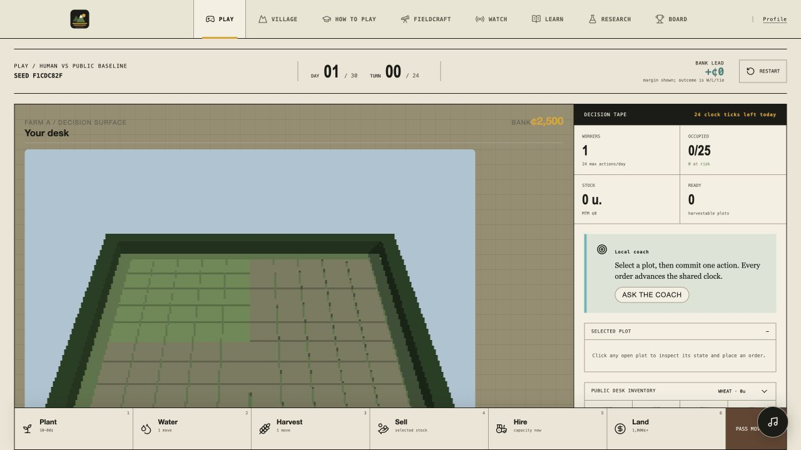 | 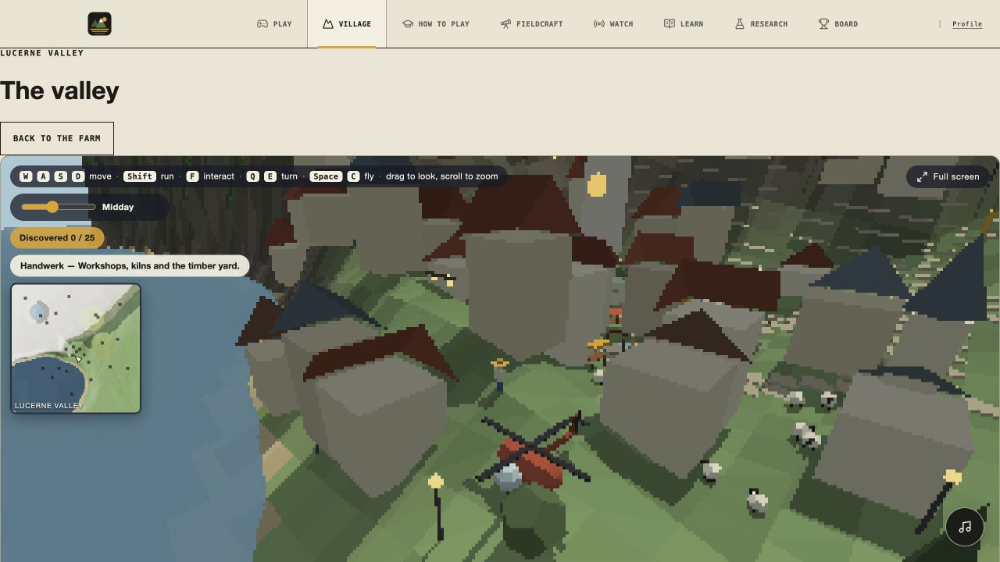 |

| How to Play — systems guide | Fieldcraft — farming through a quant lens |
| --- | --- |
| 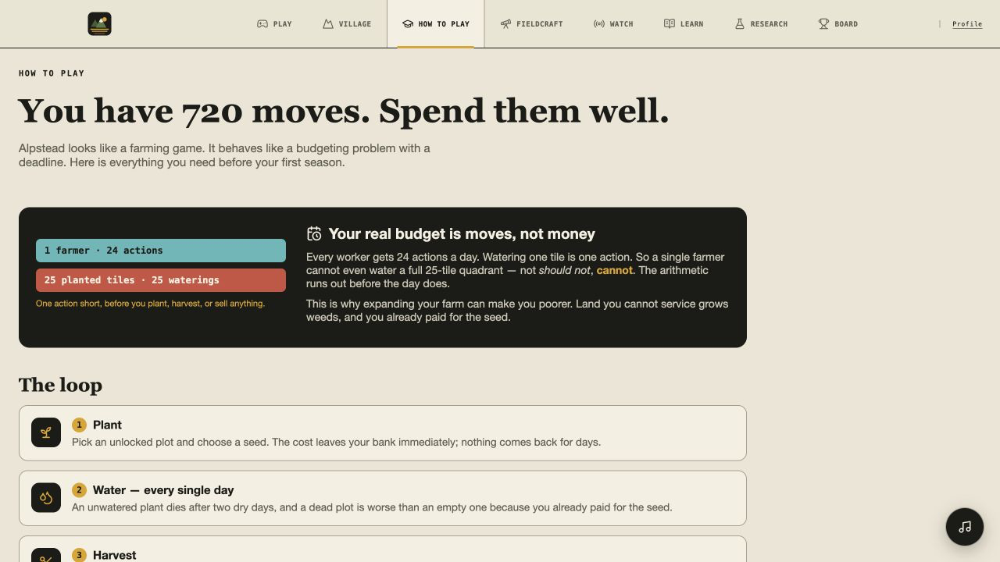 | 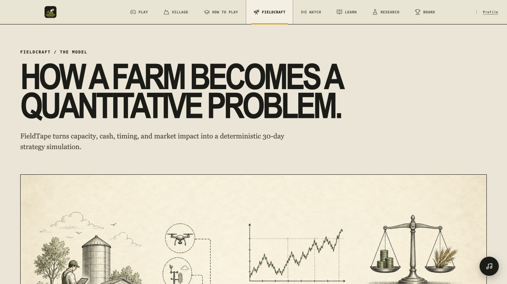 |

| Watch — public-safe replay | Learn — fundamentals and resources |
| --- | --- |
| 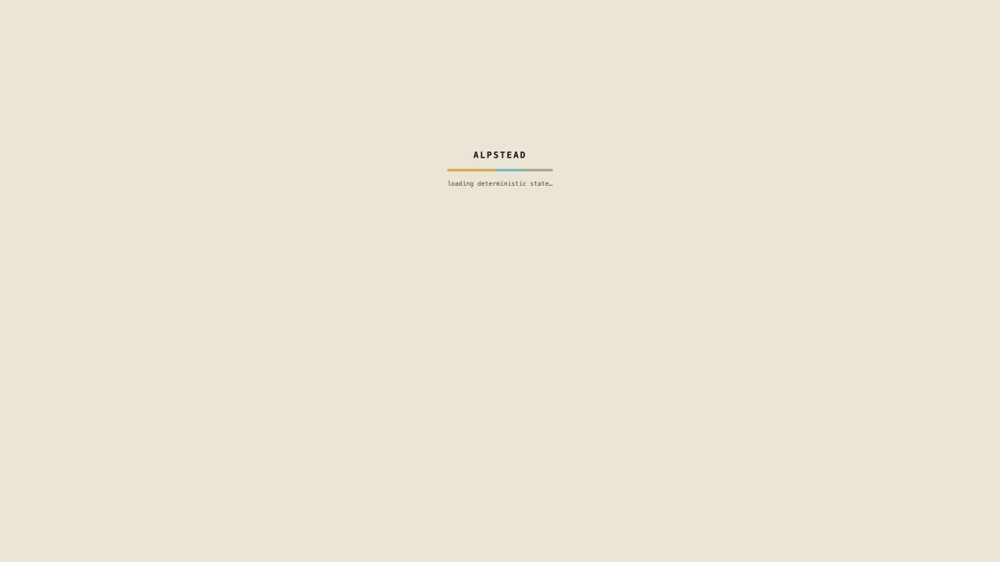 | 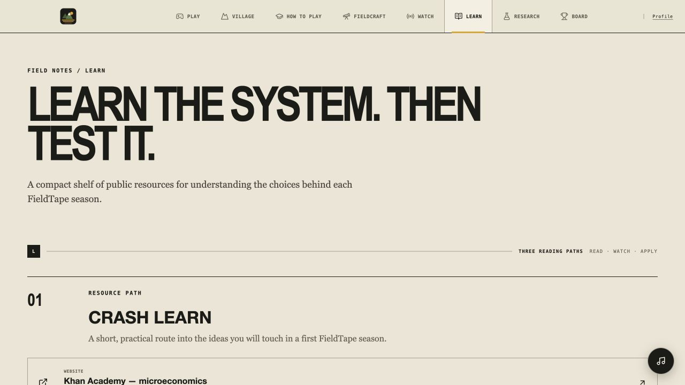 |

| Research — scenario workbench | Board — verified seasons and practice checkpoints |
| --- | --- |
| 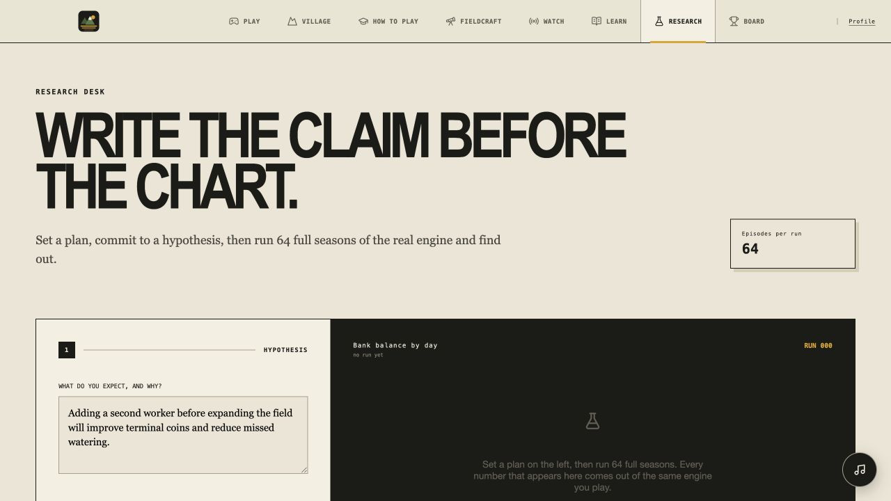 | 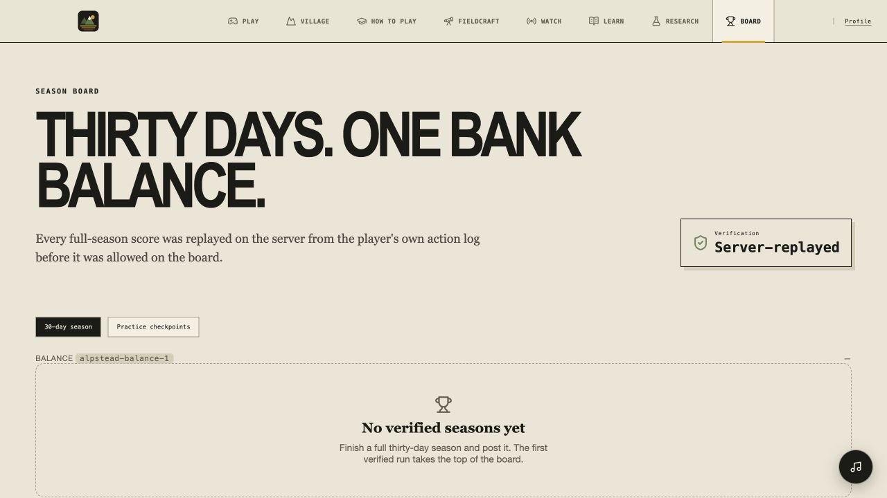 |

| Labs — interactive experiments | Profile — private progress and data controls |
| --- | --- |
| 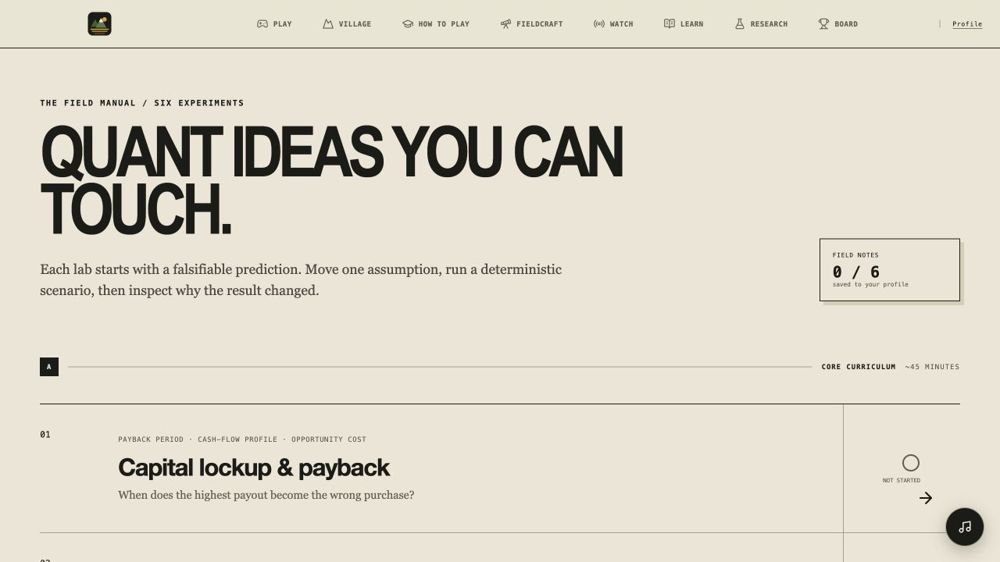 | 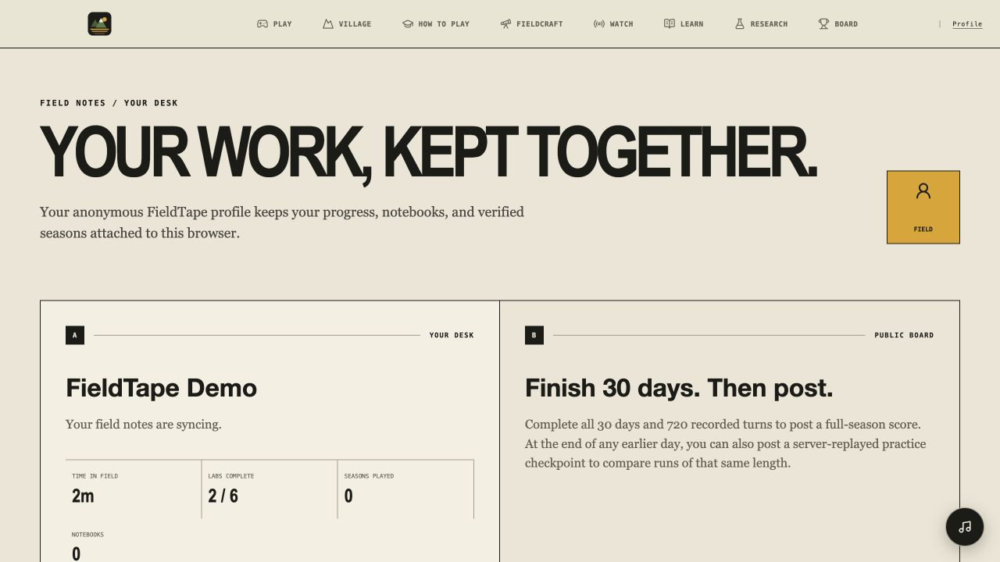 |

| Daily — focused season prompt | Landing — start a season or explore first |
| --- | --- |
| 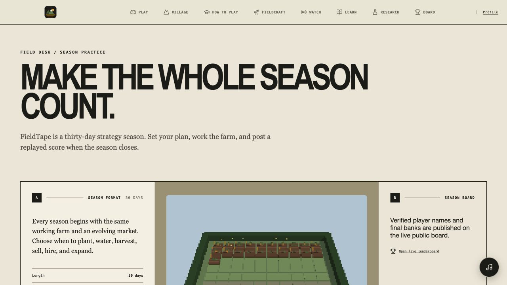 |  |

## What players can do

- Run a complete 30-day / 720-turn farm-management season.
- Plant, water, fertilize, harvest, clear weeds, raise animals, feed and care for livestock, sell stock, hire workers, and buy land.
- Use the transparent public baseline to delegate a day and inspect a different decision pattern.
- Post a complete season to the verified board.
- Post a verified practice checkpoint after any completed day—from day 1 to day 29—and compare it only with the same duration.
- Explore the 3D village with vehicles, discoveries, shops, camera controls, minimap, and fullscreen mode.
- Use Fieldcraft, Research, Learn, and Labs to understand the model rather than only chase a score.

## How verification works

FieldTape never accepts a browser-supplied final score. When a player posts a run, the server receives its ordered action timeline, replays the deterministic season itself, and stores only the reproduced result.

```text
Player actions → JWT-protected verifier → deterministic replay → verified leaderboard row
```

The verifier accepts either one valid player action per turn or the exact transparent baseline bundle created by the in-product delegation control. This stops impossible multi-action bundles from becoming “verified” scores.

## Privacy by design

Interactive routes start with an anonymous Supabase session. Players choose a display name and provide a private contact email.

- Public boards show only display name, final bank, completed days, and action count.
- Contact email stays on the player-owned profile and never appears in board reads or verification responses.
- Raw run logs, user IDs, seeds, and action timelines are not publicly exposed.
- Profile includes self-service deletion for the player’s stored FieldTape data.

## Stack

```text
Frontend     React · TypeScript · Vite · Three/WebGL
Game engine  Deterministic, replayable TypeScript simulation
Backend      Supabase Auth · Postgres · Row-Level Security · Edge Functions
Hosting      Vercel
```

## Repository map

```text
fieldtape/   Product client, game engine, 3D scenes, and product assets
supabase/    Database migrations, policies, and replay-verification function
rules/       Public rules pack and tooling
videos/      Launch-video source material
```

## Contributing

Issues and pull requests are welcome. Preserve deterministic replay behavior and do not add private competition data, policy code, private logs, or opponent information to this public repository.

## License

FieldTape is licensed under the [GNU Affero General Public License v3.0](LICENSE) (AGPL-3.0-only).
